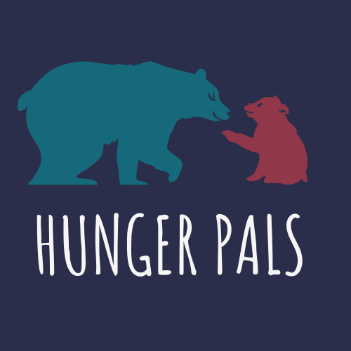
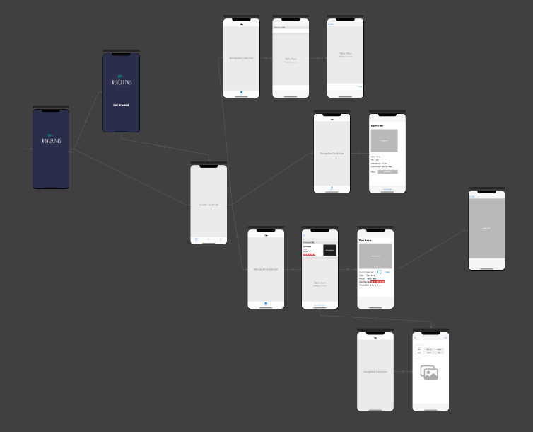
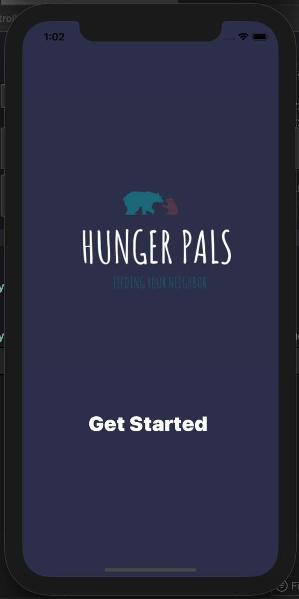
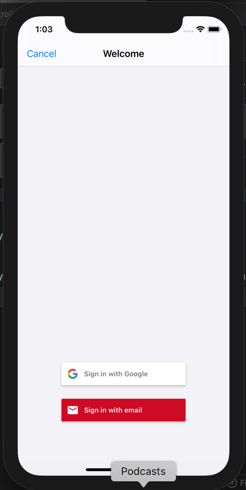
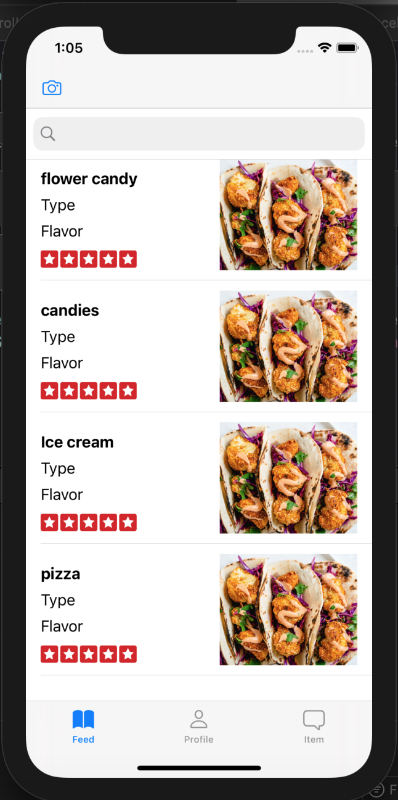
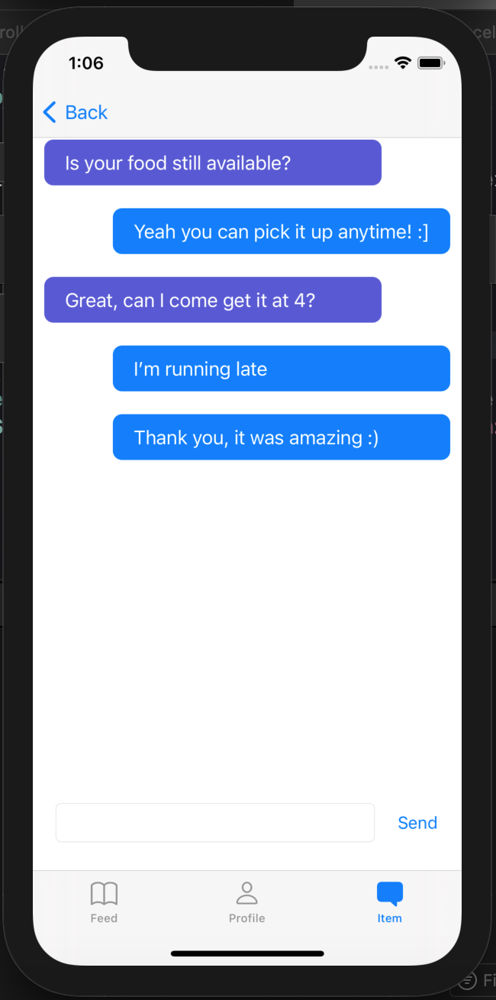

# HackDavis-2021

 

  

  <h2 align="center"></h2>
  <h3 align="center">An iOS app for food donations.</h4>

  

    HackDavis 2021 Project for Social Good. Donate food waste, instead of tossing it with this iOS application.  
     
     
    <a href="https://github.com/MelissaAppel/HackDavis-2021"><strong>Explore the docs »</strong></a>
     
  

<!-- TABLE OF CONTENTS -->

  
Table of Contents

  <ol>
    <li>
      <a href="#about-the-project">About The Project</a>
      <ul>
        <li><a href="#built-with">Built With</a></li>
      </ul>
    </li>
    <li>
      <a href="#getting-started">Getting Started</a>
      <ul>
        <li><a href="#prerequisites">Prerequisites</a></li>
        <li><a href="#installation">Installation</a></li>
      </ul>
    </li>
    <li><a href="#usage">Storyboard</a></li>
    <li><a href="#usage">Screenshots from App</a></li>
  </ol>

<!-- ABOUT THE PROJECT -->
## About The Project
An iOS application that helps users around the world donate their unwanted or unused food before it goes it waste. With the use of cloudstore, users can post images and descriptions of their food donations, respond to posts, set pins for meetup locations, and chat with users in-app. 

Features:
* Create account/login to app with gmail or email. 
* Post images and descriptions of food the user wishes to donate. 
* Respond to food posts, via in-app chat application.
* Designate meet-up location with Xcode's mapkit. 

### Built With

* [Xcode](https://developer.apple.com/xcode/)
* [Firebase](https://firebase.google.com/)

<!-- GETTING STARTED -->
## Getting Started
Application can be used on iphones only. not currently published to app store, but can be deployed to simulators on phones in Xcode, or wirelessly on personal device through Xcode. 

### Prerequisites
For use on iOS devices running iOS 13.0 and higher. 

### Installation

1. Simulation build through Xcode required until published on app store. 

## Storyboard

<!-- USAGE EXAMPLES -->
## Screenshots from App

 

 

 

